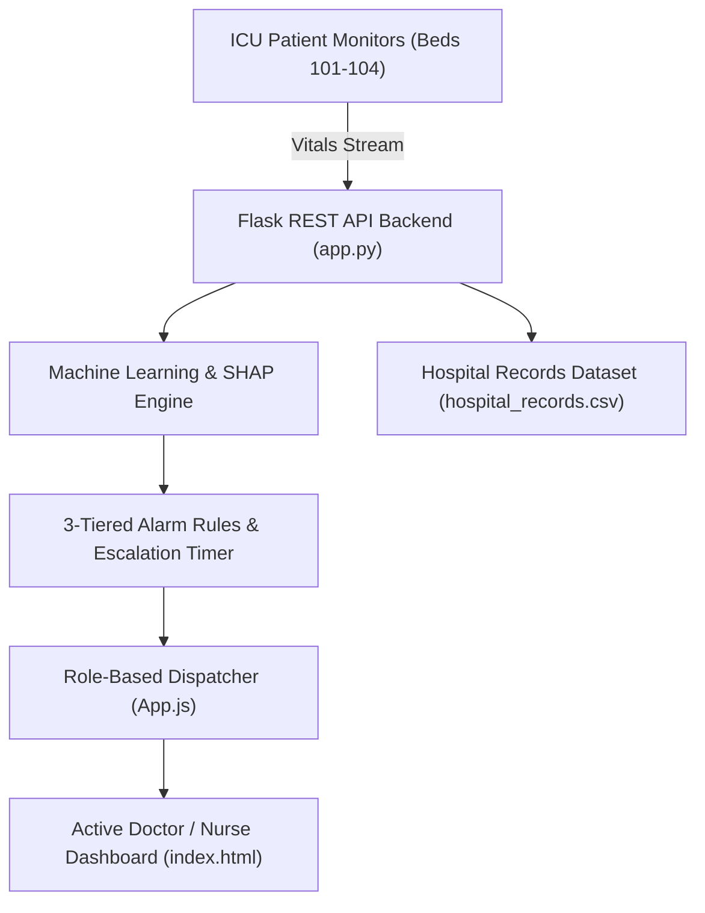

# 🏥 AMMA ICU SENTINEL
> **AI-Powered ICU Smart Alarm Burden Reduction & Clinical Decision Support (CDS) System**

[](LICENSE)
[](https://www.python.org/)
[](https://flask.palletsprojects.com/)
[]()

---

## 📌 Executive Overview

**AMMA ICU SENTINEL** is a next-generation Intensive Care Unit (ICU) telemetry monitor and clinical decision support system designed to directly combat **ICU alarm fatigue**. By combining real-time physiological telemetry, **Explainable AI (SHAP analytics)**, **3-tiered alarm triage**, and **role-based smart clinical routing**, the system filters out non-actionable alarms while ensuring critical patient deterioration events are promptly delivered to assigned nurses and physicians.

---

## ✨ Key Features

### 1. 🚨 3-Tiered Smart Alarm & Centralized Alert Messaging System
- **Real-Time Alert Feed**: Unified central alert inbox tracking all active physiological alarms across beds.
- **Severity Levels**:
  - 🔴 **CRITICAL**: Immediate life-threatening events (e.g., HR > 140 bpm, severe arrhythmias).
  - 🟠 **URGENT**: Fast-trending physiological drops (e.g., SpO₂ < 88%, severe hypoxia).
  - 🟡 **WARNING**: Parameter spikes (e.g., Blood Pressure surges, Temperature > 38.5°C).
  - 🔵 **ADVISORY**: Monitoring trends (e.g., Respiratory Rate 22 bpm baseline shifts).
- **Lifecycle Tracking**: `New` ➔ `Assigned` ➔ `Acknowledged` ➔ `Under Review` ➔ `Resolved`.
- **Action Workflow**: Direct `[ Acknowledge ]`, `[ Escalate ]`, `[ Resolve ]`, and `[ Alert History ]` audit logs.

---

### 2. 🔐 Role-Based Dynamic Clinical Routing
- **Physician & Nurse Privacy Protection**: Alarms and patient cards are filtered based on the currently logged-in clinician.
- **Dynamic Duty Update**: When a physician or nurse logs in, their assigned telemetry beds and active clinical alarms dynamically re-populate across the entire platform.
- **Charge Nurse & Multi-Doctor Override**: Multi-role administrative views allow Charge Nurses and Chief Medical Officers full visibility when needed.

---

### 3. 🤖 Explainable AI (XAI) & SHAP Risk Scoring
- **Predictive Risk Analytics**: Calculates real-time mortality and clinical deterioration risk percentage.
- **SHAP Feature Impact**: Transparently visualizes *why* an alarm was triggered (e.g., impact of SpO₂, Heart Rate, Lactate, or Mean Arterial Pressure on the clinical score).
- **Clinical Recommendations**: Provides automated, actionable medical protocol guidance alongside AI predictions.

---

### 4. ⏰ Automated Timeout Escalation Loop
- **2-Minute Window**: If an active `CRITICAL` or `URGENT` alarm goes unacknowledged by the primary nurse for 2 minutes, it automatically escalates to the **Charge Nurse**.
- **5-Minute Window**: If still unacknowledged after 5 minutes, the alarm triggers an emergency broadcast to the on-duty **ICU Physician Team**.

---

### 5. 🌓 Adaptive High-Contrast Light & Dark UI Modes
- Full dynamic contrast switching tailored for low-light night-shift monitoring and brightly lit clinical ward reviews.
- High-contrast modal cards ensure patient charts, lab values, and clinical notes are crisp and readable under any ambient light.

---

## 🛏️ Live ICU Telemetry Sync (4-Bed Core Schema)

| Bed ID | Patient Name | Demographics & Diagnosis | Primary Telemetry Trigger | Severity | Assigned Clinician |
| :--- | :--- | :--- | :--- | :--- | :--- |
| **BED 101** | `John Doe` | 64M • Cardiac Post-Op | BP Surge (158/92 mmHg) | 🟡 WARNING | Dr. Sharma / Nurse Priya |
| **BED 102** | `Sarah C.` | 52F • COPD Severe Baseline | SpO₂ Dip (86% Low O₂) | 🟠 URGENT | Dr. Sharma / Nurse Rahul |
| **BED 103** | `Robert M.` | 71M • Sepsis Telemetry | Heart Rate (142 bpm Tachycardia) | 🔴 CRITICAL | Dr. Sharma / Nurse Rahul |
| **BED 104** | `Elena R.` | 45F • Acute Trauma ICU | Resp Rate (22 bpm Trend) | 🔵 ADVISORY | Dr. Sharma / Nurse Anil |

---

## 🛠️ System Architecture & Tech Stack



- **Frontend**: HTML5, CSS3 (Glassmorphic Medical Theme, Custom Utility Framework), JavaScript (ES6+ Modular Architecture, Chart.js, FontAwesome 6).
- **Backend API**: Python 3.9+, Flask Web Framework, RESTful JSON Endpoints (`/api/beds`, `/api/alerts`).
- **Data & AI Stack**: Pandas, NumPy, Scikit-Learn (Random Forest Classifier), SHAP (SHapley Additive exPlanations).

---

## 🚀 Quick Start & Installation

### Prerequisites
- Python 3.9 or higher
- Modern Web Browser (Chrome, Edge, Firefox, Safari)
- Git

### 1. Clone Repository
```bash
git clone https://github.com/YOUR_USERNAME/icu-smart-alarm.git
cd icu-smart-alarm
```

### 2. Set Up Virtual Environment & Install Dependencies
```bash
# Create virtual environment
python -m venv venv

# Activate virtual environment
# Windows:
venv\Scripts\activate
# macOS/Linux:
source venv/bin/activate

# Install requirements
pip install flask pandas numpy scikit-learn shap
```

### 3. Launch the Backend Server
```bash
python app.py
```
*The Flask server will start at `http://127.0.0.1:5000`.*

### 4. Launch the Clinical Portal
Open `index.html` directly in your browser or serve via any static web server (e.g. Live Server extension in VS Code).

---

## 📁 Repository Structure

```
icu-smart-alarm/
├── app.py                      # Flask RESTful Backend API & ML inference server
├── hospital_records.csv        # Core EHR patient records & telemetry database
├── index.html                  # Main Clinical Portal interface
├── app.js                      # Application controller, telemetry loop & 3-tier alarm manager
├── styles.css                  # UI styling, glassmorphism theme & light/dark mode overrides
├── README.md                   # System documentation & GitHub project manual
└── requirements.txt            # Python dependencies list
```

---

## 🤝 Clinical Workflow & Verification

1. **Login**: Select clinician profile (`Dr. Sharma`, `Nurse Priya`, `Nurse Rahul`, etc.).
2. **Telemetry Dashboard**: Monitor real-time vitals update across assigned beds.
3. **Alert Actioning**:
   - Click `[ Acknowledge ]` to take ownership of an active alert.
   - Click `[ Escalate ]` to transfer urgent alerts to the Charge Nurse/Doctor team.
   - Click `[ Resolve ]` upon completing intervention to clear the alarm.
4. **SHAP AI Inspection**: Open patient risk breakdown modal to inspect contributing physiological risk factors.

---

## 📜 License & Acknowledgments

- **Project Name**: AMMA ICU SENTINEL
- **Domain**: Medical Informatics & Clinical Decision Support Systems
- **License**: MIT License - open for educational and research use.
