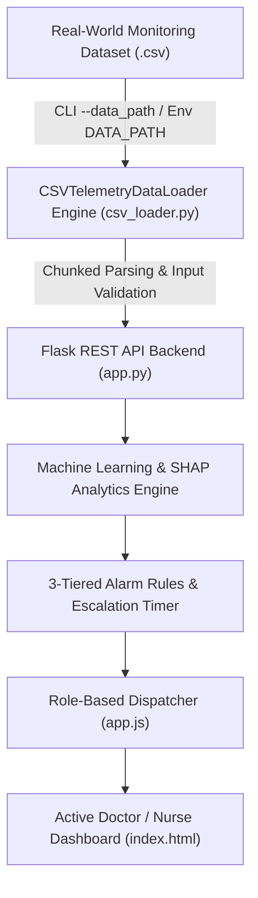

# 🏥 AMMA ICU SENTINEL
> **AI-Powered ICU Smart Alarm Burden Reduction & Clinical Decision Support (CDS) System**

[](LICENSE)
[](https://www.python.org/)
[](https://flask.palletsprojects.com/)
[]()

---

## 📌 Executive Overview

**AMMA ICU SENTINEL** is a next-generation Intensive Care Unit (ICU) telemetry monitor and clinical decision support system designed to directly combat **ICU alarm fatigue**. By combining real-time physiological telemetry, **Explainable AI (SHAP analytics)**, **3-tiered alarm triage**, and **role-based smart clinical routing**, the system filters out non-actionable alarms while ensuring critical patient deterioration events are promptly delivered to assigned nurses and physicians.

---

## 📊 Real-World CSV Data Pipeline & Custom Dataset Execution

The data ingestion engine (`backend/csv_loader.py`) replaces synthetic/hardcoded mock data with a dynamic real-world CSV loader.

### Features of the CSV Data Engine:
- **Dynamic Schema Alignment**: Automatically maps column aliases (`heart_rate` ➔ `hr`, `oxygen_saturation` ➔ `spo2`, `systolic_bp` ➔ `sys_bp`, `diastolic_bp` ➔ `dia_bp`, `respiratory_rate` ➔ `rr`, `signal_quality` ➔ `sqi`, etc.).
- **Input Validation & Imputation**: Handles missing/malformed rows cleanly by imputing median values and clipping physiological outliers.
- **Scalable Chunked Streaming**: Supports streaming parsing via `chunksize` for large multi-gigabyte time-series monitoring datasets.
- **Configurable Dataset Path**: Run the system with any custom `.csv` monitoring dataset via CLI arguments or environment variables.

---

## 🚀 Usage Instructions: Running with a Custom CSV Dataset

### 1. Execute via Command-Line Arguments (`--data_path` / `-d`):
```bash
# Run Flask backend with a custom real-world monitoring dataset
python backend/app.py --data_path path/to/your_monitoring_data.csv --port 5000

# Or run via root entry point
python app.py -d data/telemetry_dataset.csv --port 5000 --chunksize 10000
```

### 2. Execute via Environment Variable (`DATA_PATH`):
```bash
# Windows PowerShell:
$env:DATA_PATH="path/to/your_monitoring_data.csv"
python app.py

# macOS / Linux:
export DATA_PATH="path/to/your_monitoring_data.csv"
python app.py
```

### 3. CLI Command Options:
```
options:
  -h, --help            Show help message and exit
  -d, --data_path DATA_PATH Path to real-world monitoring dataset .csv file
  -p, --port PORT       Port to run Flask server on (default: 5000)
  --host HOST           Host interface (default: 127.0.0.1)
  --chunksize CHUNKSIZE Chunksize for scalable CSV parsing (default: 5000)
```

---

## ✨ Key Features

### 1. 🚨 3-Tiered Smart Alarm & Centralized Alert Messaging System
- **Real-Time Alert Feed**: Unified central alert inbox tracking all active physiological alarms across beds.
- **Severity Levels**:
  - 🔴 **CRITICAL**: Immediate life-threatening events (e.g., HR > 140 bpm, severe arrhythmias).
  - 🟠 **URGENT**: Fast-trending physiological drops (e.g., SpO₂ < 88%, severe hypoxia).
  - 🟡 **WARNING**: Parameter spikes (e.g., Blood Pressure surges, Temperature > 38.5°C).
  - 🔵 **ADVISORY**: Monitoring trends (e.g., Respiratory Rate 22 bpm baseline shifts).
- **Lifecycle Tracking**: `New` ➔ `Assigned` ➔ `Acknowledged` ➔ `Under Review` ➔ `Resolved`.
- **Action Workflow**: Direct `[ Acknowledge ]`, `[ Escalate ]`, `[ Resolve ]`, and `[ Alert History ]` audit logs.

---

### 2. 🔐 Role-Based Dynamic Clinical Routing
- **Physician & Nurse Privacy Protection**: Alarms and patient cards are filtered based on the currently logged-in clinician.
- **Dynamic Duty Update**: When a physician or nurse logs in, their assigned telemetry beds and active clinical alarms dynamically re-populate across the entire platform.
- **Charge Nurse & Multi-Doctor Override**: Multi-role administrative views allow Charge Nurses and Chief Medical Officers full visibility when needed.

---

### 3. 🤖 Explainable AI (XAI) & SHAP Risk Scoring
- **Predictive Risk Analytics**: Calculates real-time mortality and clinical deterioration risk percentage.
- **SHAP Feature Impact**: Transparently visualizes *why* an alarm was triggered (e.g., impact of SpO₂, Heart Rate, Lactate, or Mean Arterial Pressure on the clinical score).
- **Clinical Recommendations**: Provides automated, actionable medical protocol guidance alongside AI predictions.

---

### 4. ⏰ Automated Timeout Escalation Loop
- **2-Minute Window**: If an active `CRITICAL` or `URGENT` alarm goes unacknowledged by the primary nurse for 2 minutes, it automatically escalates to the **Charge Nurse**.
- **5-Minute Window**: If still unacknowledged after 5 minutes, the alarm triggers an emergency broadcast to the on-duty **ICU Physician Team**.

---

### 5. 🌓 Adaptive High-Contrast Light & Dark UI Modes
- Full dynamic contrast switching tailored for low-light night-shift monitoring and brightly lit clinical ward reviews.
- High-contrast modal cards ensure patient charts, lab values, and clinical notes are crisp and readable under any ambient light.

---

## 🛠️ System Architecture & Tech Stack



- **Frontend**: HTML5, CSS3 (Glassmorphic Medical Theme, Custom Utility Framework), JavaScript (ES6+ Modular Architecture, Chart.js, FontAwesome 6).
- **Backend API**: Python 3.9+, Flask Web Framework, RESTful JSON Endpoints (`/api/beds`, `/api/telemetry`, `/api/predict`, `/api/records`).
- **Data & AI Stack**: Pandas, NumPy, Scikit-Learn (Random Forest Classifier), SHAP (SHapley Additive exPlanations).

---

## 📁 Repository Structure

```
icu-smart-alarm/
├── app.py                      # Root entry point with CLI argument support (--data_path)
├── backend/
│   ├── app.py                  # Flask RESTful Backend API & ML inference server
│   └── csv_loader.py           # Real-world CSV Data Loader engine (chunked parsing & validation)
├── data/
│   ├── telemetry_dataset.csv   # Real-world time-series ICU monitoring dataset
│   └── hospital_records.csv    # Core EHR patient records & audit database
├── Frontend/
│   ├── index.html              # Main Clinical Portal interface
│   ├── app.js                  # Application controller, telemetry loop & 3-tier alarm manager
│   └── styles.css              # UI styling, glassmorphism theme & light/dark mode overrides
├── README.md                   # System documentation & GitHub project manual
└── requirements.txt            # Python dependencies list
```

---

## 📜 License & Acknowledgments

- **Project Name**: AMMA ICU SENTINEL
- **Domain**: Medical Informatics & Clinical Decision Support Systems
- **License**: MIT License - open for educational and research use.
